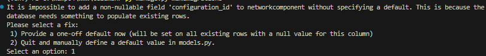
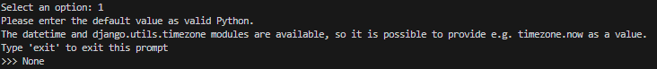
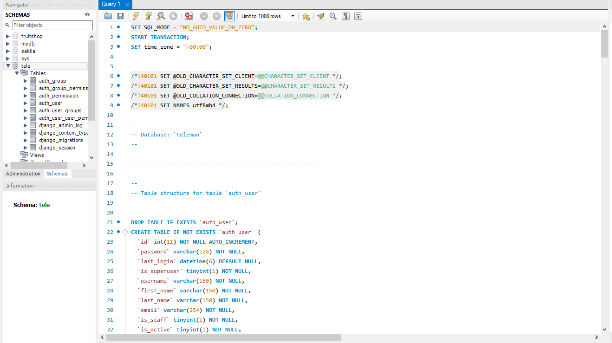
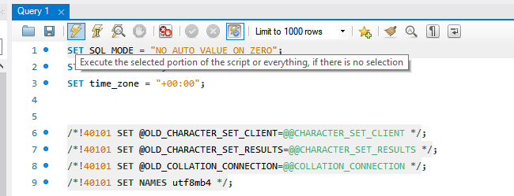

# TELEMAN

## NEW!

After pulling the new updates, do this:

In the directory of the project, open a terminal and run these commands:

```bash
pip install -r requirements.txt
```

This will install the packege "django-include-by-ajax"

Then proceed with the following command

```bash
python manage.py migrate
#or for others
py manage.py migrate
```

If you encounter such a prompt after typing that:



Type 1 to select Option 1 as seen above, then press Enter

Then after getting the prompt below, type the word **None**, just as seen below



Then press Enter

### Repeat this for every such prompt that comes your way!

<hr/>

After that step is done, your database should now be ready for the next step

Navigate to the newly created folder in the root of the teleman directory

Find the folder named DB Setup. Inside is a file called teleman.sql

Use your MySQL Server to import that data into the database

Procedure Below:

Select the target database, for you it should be **teleman**

(Ensure the correct schema is selected! i.e teleman)



Copy the Script from teleman.sql into the editor and click on the Run button, as shown below



That should import all the data into the database

<br/>

From here, navigate to the same DB Setup Folder

Locate the DATABASE SEED.docx file, this contains database information

Use this to login into different accounts on the system

### NOTE! Functionality of data display based on accounts logged in will be available in the next update!

<br/>
<br/>
<br/>

<hr/>

## INITIAL SETUP

To initialize the project:

Ensure Python with a version greater than 3.10 is installed and is in the PATH as the active Python executable

Ensure pip and virtualenv is installed

Confirm them all by typing in a terminal

```bash
python --version
# or
python3 --version
```

```bash
pip --version
# or
pip3 --version
```

if they are not installed, Download and install python first

Then install pip using:

```bash
python get-pip.py
# or
python3 get-pip.py
```

Then install virtualenv using:

```bash
pip install virtualenv
# or
pip3 install virtualenv
```

Confirm the installation by checking the version as above

<hr/>

Set your terminal to the folder's workspace

Run

```bash
virtualenv venv
```

```bash
venv/Scripts/activate
```

```bash
pip install -r requirements.txt
```

<hr/>

Create a Database in your local MySQL Server and name it **teleman**

Copy the file located at /teleman/.env.example and rename it to .env, just within the same folder

Replace the credentials in the file with your server's configuration

<hr/>

Then run

```bash
py manage.py migrate
```

```bash
py manage.py runserver
```

Visit the generated URL as seen in the terminal,

Usually


```bash
http://localhost:8000
```

If you see a welcome page stating "The install worked successfully", you are good!
